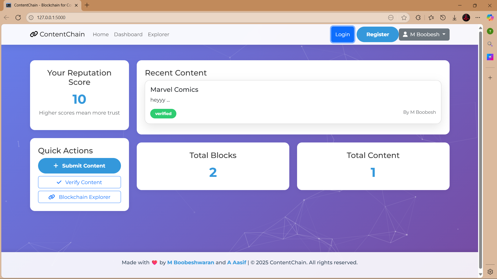
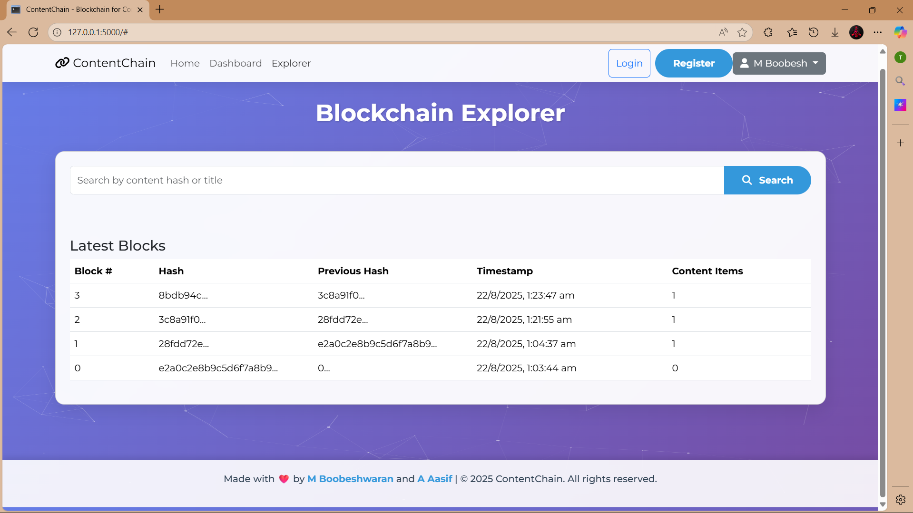

ContentChain - Blockchain-Powered Content Verification Platform

📖 Overview
ContentChain is a revolutionary platform that leverages blockchain technology and AI-powered verification to combat misinformation and ensure content authenticity. By creating an immutable record of verified content, ContentChain provides a trust layer for digital information in an era of increasing misinformation.

Project Screenshots  :

Main Page 

Registration Page

Login Page

Dashboard page

Explorer Page

Content Summision

Content Verification

Verification Result

Updated Dashboard

✨ Key Features
🔗 Blockchain Verification - Immutable content hashing and storage

🤖 AI Fact-Checking - Automated analysis for misinformation detection

🏆 Reputation System - Trust scoring for content creators

🔍 Content Explorer - Search and verify any content

📊 Dashboard Analytics - Track your content performance

🌐 User-Friendly Interface - Modern, responsive web design

🏗️ Technology Stack

Backend :

Python 🐍 with Flask web framework
MongoDB 🍃 with PyMongo driver
JWT authentication
bcrypt for password hashing
Custom blockchain implementation

Frontend :

HTML5, CSS3, JavaScript
Bootstrap 5 for responsive design
Particles.js for interactive background
Font Awesome for icons

Blockchain Components:

Proof-of-Work consensus mechanism
SHA-256 hashing algorithm
Immutable ledger for content storage
Content hashing for verification

📁 Project Structure

ContentChain/
├── app.py                 # Flask backend server
├── interface/            # Frontend templates
│   └── index.html        # Main HTML file
├── requirements.txt      # Python dependencies
└── README.md            # This file

🚀 Installation & Setup

Prerequisites

Python 3.8 or higher
MongoDB (local or cloud instance)
Modern web browser

Step 1: Clone the Repository

git clone https://github.com/boobesh2k5/contentchain.git
cd contentchain

Step 2: Set Up Virtual Environment

# Create virtual environment
python -m venv venv
# Activate virtual environment
# On Windows:
venv\Scripts\activate
# On macOS/Linux:
source venv/bin/activate

Step 3: Install Dependencies

pip install -r requirements.txt
If you don't have a requirements.txt, install these packages:
pip install flask flask-bcrypt pymongo jwt

Step 4: Configure Environment Variables

Create a .env file in the root directory with:
MONGO_URI=mongodb://localhost:27017/skillforgex
JWT_SECRET_KEY=your-super-secret-jwt-key-here

Step 5: Run the Application

python app.py
The application will be available at http://localhost:5000

🎮 How to Use ContentChain

For Content Consumers :

Verify Content: Use the "Verify Content" feature to check any content's authenticity
Search Blockchain: Explore the blockchain to see verified content
Vote on Content: Help the community by voting on content trustworthiness

For Content Creators :

Register/Login: Create an account to start submitting content
Submit Content: Add your content through the dashboard
Build Reputation: Earn reputation points as your content gets verified
Track Performance: Monitor your content's verification status and community feedback

🧠 Blockchain Implementation

ContentChain implements a custom blockchain with:
Proof-of-Work consensus algorithm
SHA-256 hashing for content integrity
5-content blocks (transactions are batched every 5 content submissions)
Immutable ledger stored in MongoDB
Genesis block initialization

Each block contains:

Index
Timestamp
Content data
Previous hash
Nonce (for PoW)
Current hash

🤝 Contributing

We welcome contributions! Please feel free to submit pull requests or open issues for bugs and feature requests.

Development Setup :

Fork the repository
Create a feature branch (git checkout -b feature/amazing-feature)
Commit your changes (git commit -m 'Add amazing feature')
Push to the branch (git push origin feature/amazing-feature)
Open a Pull Request

📜 License

This project is licensed under the MIT License - see the LICENSE file for details.

👥 Developers :

Made with ❤️ by:

M Boobeshwaran
A Aasif

🙏 Acknowledgments

Blockchain concept inspired by Bitcoin and Ethereum
UI design uses Bootstrap and Font Awesome
Particles.js for interactive background effects

🔮 Future Enhancements

IPFS integration for decentralized content storage
Enhanced AI verification with machine learning models
Mobile application
Browser extension for content verification
Advanced analytics dashboard
Multi-language support

ContentChain - Building trust in digital content, one block at a time. 🚀

